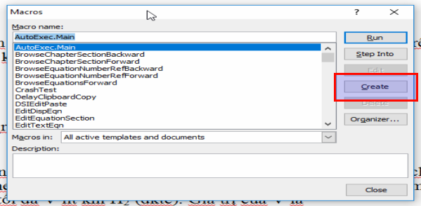
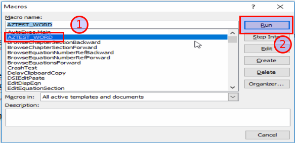
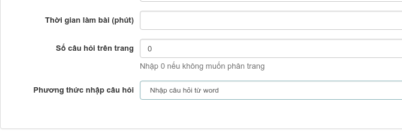

##**Nhập câu hỏi từ Microsoft Word**

###**Đối với đề thi có chứa công thức toán học**

Để tải đề thi có chứa công thức toán học lên hệ thống, bạn cần phải qua một số thao tác kỹ thuật nhằm chuyển công thức toán sang dạng ký hiệu. Hướng dẫn dưới đây sẽ giúp bạn làm điều này. Nếu đề thi của bạn không chứa công thức toán học, đơn giản hãy bỏ qua phần này và chuyển sang phần 2 bên dưới.

####**Cài đặt phần mềm MathType**
Đây là phần mềm thương mại giúp bạn có thể soạn thảo công thức toán học, sau khi cài đặt nó sẽ được tích hợp trong bộ Office của Microsoft. Ngoài tính năng chính là soạn thảo công thức, phần mềm này có một số công cụ giúp chúng ta chuyển đổi công thức sang nhiều định dạng khác nhau.

Tải về phiên bản mới nhất và tiến hành cài đặt tại [http://www.dessci.com/en/products/mathtype/](http://www.dessci.com/en/products/mathtype/)

####**Sử dụng MathType chuyển đổi công thức toán học sang mã Tex**
- Chọn toàn bộ văn bản (bôi đen)

- Trên thanh định dạng chọn **MathType**, chọn tiếp **Toggle Tex**


Lúc này văn bản chuyển sang dạng như sau:


Lưu nội dung mới này là để thực hiện bước tiếp theo.

###**Chỉnh sửa đề thi theo chuẩn của hệ thống yêu cầu**

####**Kiểm tra và thay đổi nội dung đề thi**

>***Lưu ý:** Hệ thống sẽ tự động xóa hết tất cả các định dạng trong nội dung đề thi (in đậm, in nghiêng, hình ảnh, màu sắc,....). Do đó, bạn cần định dạng lại nội dung sau khi thêm câu hỏi thành công.*

Đối với mỗi câu hỏi bạn thực hiện lần lượt các thao tác sau:

-	Mỗi câu hỏi, đáp án nằm trên một hàng riêng biệt

-	Không cần đánh thứ tự số câu. Ví dụ: Câu 1, Câu 2,...... Nếu có, hãy xóa nó đi (Hệ thống sẽ tự đánh khi thể hiện đề thi)

-	Không cần đánh thứ tự đán án. Ví dụ: A, B, C, D,..... Nếu có, hãy xóa nó đi (Hệ thống sẽ tự đánh khi thể hiện đề thi)

-	Đánh dấu đáp án đúng bằng ký tự sao (*), đằng trước đáp án đúng

-	Mỗi bộ câu hỏi (gồm câu hỏi và đáp án) cách nhau bởi một dòng trắng (Enter)

Xem ví dụ:

```
Xà phòng hóa hoàn toàn 265,2 gam chất béo (X) bằng dung dịch KOH thu được 288 gam một muối kali duy nhất. Tên gọi của X là
*tripanmitoyl glixerol (hay tripanmitin).
trilinoleoyl glixerol (hay trilinolein).
tristearoyl glixerol (hay tristearin).
trioleoyl glixerol (hay triolein).
Nhiều vụ ngộ độc rượu do trong rượu có chứa metanol. Công thức của metanol là

*C2H5OH	
H-CHO	
CH3COOH	
CH3OH

X là sản phẩm sinh ra khi cho fructozơ tác dụng với H2. Đốt cháy hoàn toàn m gam hỗn hợp Y gồm: ancol metylic, glixerol và X thu được 5,6 lít khí CO2 (đktc). Cũng m gam Y trên cho tác dụng với Na dư thu được tối đa V lít khí H2 (đktc). Giá trị của V là
4,48
2,80	
*3,36	
5,60
```
Lưu nội dung mới này là để thực hiện bước tiếp theo.

####**Sử dụng macro tự động chuyển sang cấu trúc chuẩn để AZtest hiểu**

#####**Cài đặt macro AZtest**

Việc cài đặt marco này chỉ thực hiện một lần trên một máy tính, lần sau bạn không cần phải thực hiện bước này nữa.
Bước 1:
- Trên giao diện Microsoft Word (2007 -> 2013), chọn tab **View => Macros => View macros**


- Trên cửa sổ nhỏ mới xuất hiện, chọn **Create** để tạo mới marco.




- Trên cửa sổ lớn mới xuất hiện, xóa hết nội dung có sẵn, sau đó copy nội nội mới này vào.

```
Sub AZTEST_WORD()
    Dim MyText As String
    Dim MyRange As Object
    iParcount = ActiveDocument.Paragraphs.Count
    Dim I, J, Question As Long
    J = 1
    I = 1
    Question = 1
    Do
        ' Lay du lieu cua doan van
       Set MyRange = ActiveDocument.Paragraphs(J).Range
       ' Doan van dau tien la de bai, them tieu de cau hoi va dau ngoac nhon
       If I = 1 Then
          MyText = "::Question" & Question & "::"
          MyRange.InsertBefore (MyText)
          MyText = "[BEGIN]" & Chr(13)
          MyRange.InsertAfter (MyText)
          J = J + 1
          iParcount = iParcount + 1   ' Do them 1 dong moi
          Set MyRange = ActiveDocument.Paragraphs(J).Range
       End If
       ' Doan van thu 2 den 5 la cac dap an, them dau nga
       If I = 2 Or I = 3 Or I = 4 Or I = 5 Then
          MyText = "~"
          MyRange.InsertBefore (MyText)
       End If
       ' Doan van cuoi cung them dau ngoac ket thuc cau hoi
       If I = 5 Then
          MyText = "[END]" & Chr(13)
          MyRange.InsertAfter (MyText)
          J = J + 1
          iParcount = iParcount + 1   ' Do them 1 dong moi
          Set MyRange = ActiveDocument.Paragraphs(J).Range
       End If
       ' Cap nhat lai gia tri i the hien cau nao trong cau hoi trac nghiem
       I = I + 1
       If I = 7 Then
            I = 1
            Question = Question + 1
       End If
       J = J + 1
    Loop Until J > iParcount
        ' Thay the ~* thanh dau =: dap an
    With ActiveDocument.Content.Find
    .ClearFormatting
    With .Replacement
        .ClearFormatting
        .Font.Bold = False
    End With
    .Execute FindText:="~*", ReplaceWith:="=", Replace:=wdReplaceAll
    End With
End Sub
```


Nhấn **Ctrl + S** để lưu lại, bây giờ có thể đóng cửa sổ này.

#####**Tự động chuyển về cấu trúc hợp lệ**

- Thực hiện lại bước **Cài đặt macro AZtest**, song lúc này chúng ta sẽ thấy marco **AZTEST_WORD** đã được cài đặt. Nhấn chọn **AZTEST_WORD** (1) và nhấn **RUN** (2)
- Nội dung file word lúc này sẽ được tự động định dạng lại để phù hợp với yêu cầu của hệ thống AZtest, copy lại nội dung này để thực hiện bước tiếp theo.



###**Thực hiện import câu hỏi cho đề thi**

- Sau khi hoàn tất các bước chỉnh sửa đề thi theo cấu hình từ word, bây giờ tiến hành import câu hỏi vào đề thi thuộc hệ thống **AZtest**. 

- Trong khi tạo đề thi mới, bạn hãy chú ý đến phần **Phương thức nhập câu hỏi**, bạn hãy chọn **Nhập câu hỏi từ word**.


 

- Sau khi tạo đề thi thành công, hệ thống sẽ chuyển bạn đến khu vực câu hỏi thuộc đề thi. Tại đây, bạn copy đề thi đã chỉnh sửa.
 
 


