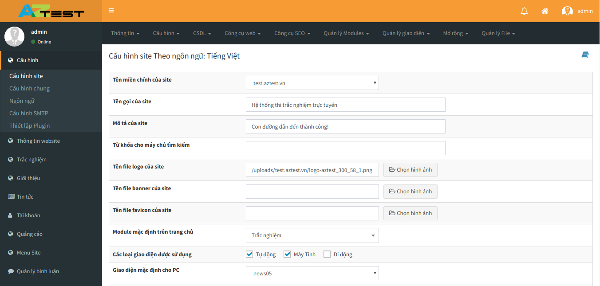
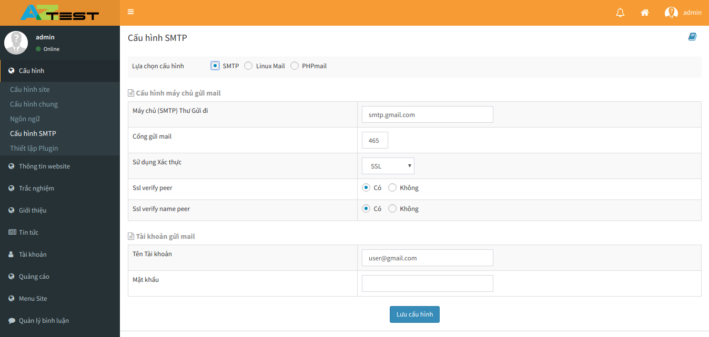
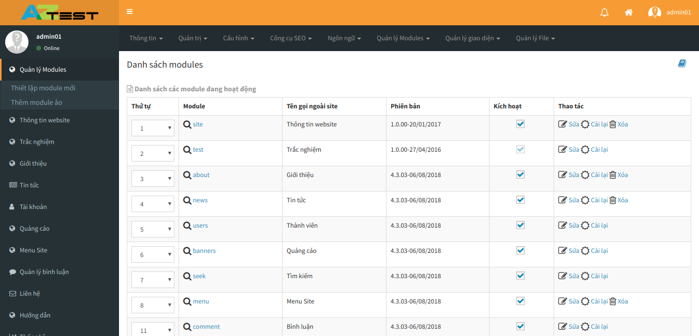
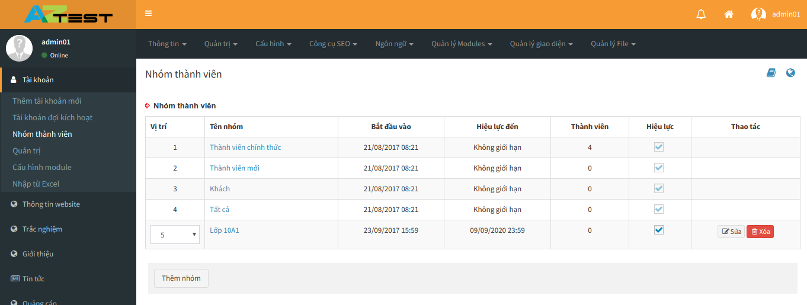
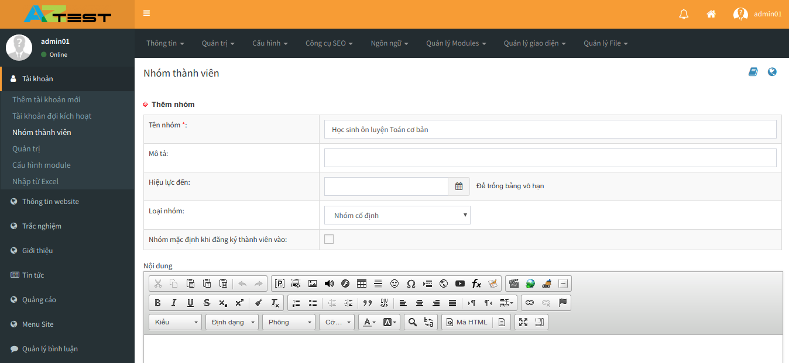
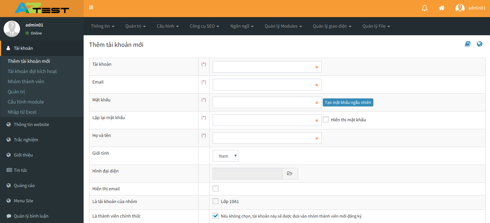
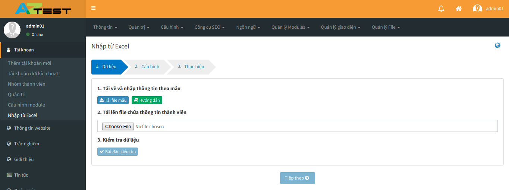
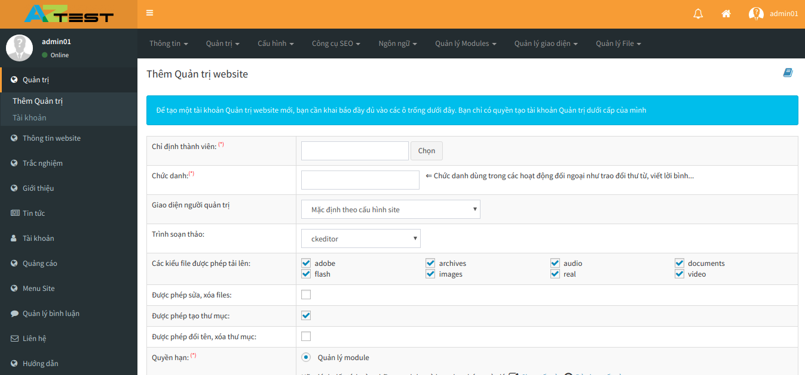

## Cấu hình thông tin website

Bạn có thể thay đổi các thông tin cơ bản của website như tiêu đề, mô tả, logo,... bằng cách thực hiện các thao tác sau:

- Đăng nhập vào quản trị website.
- Tại giao diện chính, chọn **Cấu hình** (Menu ngang)
- Trong giao diện này, bạn có thể thay đổi nội dung theo mong muốn, sau đó nhấn **Lưu cấu hình** ở cuối trang để lưu lại thiết lập.
 

Ngoài ra, bạn cũng có thể thay đổi các thông tin nâng cao hơn tại phần **Cấu hình / Cấu hình chung**

## Cấu hình máy chủ gửi thư (Email)

Mặc định, AZtest đã thiết lập máy chủ gửi thư để website có thể gửi thư đi mà không cần cấu hình thêm. Song, AZtest cũng cung cấp giải pháp để những người am hiểu kỹ thuật có thể tự cấu hình máy chủ gửi thư của riêng họ.

- Truy cập menu (ngang) **Cấu hình / Cấu hình SMTP**
- Trong 3 tùy chọn ở đây, chọn giao thức SMPT và điền các thông số như hình hướng dẫn rồi lưu lại.

## Quản lý module
Trong một hệ thống quản lý website có rất nhiều module và để quản lý được module người dùng muốn quản lý người dùng cần chọn menu "**Quản lý module**". Mục quản lý module giúp người dùng quản lý từng module nhỏ trong hệ thống website.

Ở mục quản lý module người dùng có thể tháo tác can thiệp vào các module như kích hoạt, nghưng kích hoạt, sửa, cài lại và xóa.
Nếu cài lại module người dùng có thể làm như sau:

Bước 1: Chọn module cần cài và chọn cài lại.

Bước 2: Khi cài đặt module nếu module có dữ liệu mẫu bạn cần thao tác chọn cách thức cài đặt có chứa dữ liệu mẫu hoặc là không, và chọn cài đặt.

Bước 3: Sau khi cài đặt thành công chọn hoàn tất.

> * Lưu ý: việc cài lại module này chỉ cho phép đối với các module chứa trong hệ thống, hoặc là các module của hệ thống AZtest cung cấp cho người dùng.

## Quản lý giao diện người dùng

Để quản lý giao diện website , người dùng vào mục "**Quản lý giao diện**" trên thanh menu để hiểu chỉnh website.

Ở mục "**Quản lý giao diện**" người dùng có thể thiết lập giao diện, layout và quản lý các block.

Để thay đổi kích hoạt người dùng có thể tháo tác sau:

Bước 1: Chọn giao diện người dùng muốn kích hoạt hoặc cài đặt.

Bước 2: Chọn kích hoạt giao diện sử dụng.

Quản lý giao diện là nơi người dùng có thể tùy chỉnh layout bố cục của website hoặc tùy chỉnh các block theo ý muốn của người dùng.
> Lưu ý: Các giao diện và block người dùng cài đặt thiết lập chỉ có trong hệ thống.

> Các giao diện mặc định của hệ thống, bạn không được xóa, đổi tên và không nên sửa trực tiếp vào giao diện này. Nếu muốn, hãy copy thành giao diện khác và kích hoạt sử dụng giao diện mới đó để chỉnh sửa và sử dụng.

## Quản lý nhóm thành viên

Để quản lý nhóm thành viên người dùng chọn "**Tài khoản và chọn nhóm thành viên**", ở mục nhóm thành viên người dùng có thể quản lý tất cả các nhóm thành viên bằng các phân quyền có sẵn như tạo nhóm thành viên, thêm, sửa, xóa tài khoản thành viên và nhiều phần quyền khác. Các nhóm thành viên đều có hiệu lực riêng tùy vào người sử dụng phân quyền.

 

### Thêm nhóm

Để thêm nhóm thành viên người dùng chọn thêm nhóm, điền tất cả thông tin về nhóm như tên nhóm, mô tả và các phân quyền của nhóm mà người dùng cho phép.

Để thêm nhóm thành viên người dùng cần thao tác:

Bước 1: Chọn thêm nhóm và điền các thông tin nhóm vào.

Bước 2: chọn loại nhóm và các nội dung của nhóm.

Bước 3: Cấu hình quyền hạn sử dụng module của trưởng nhóm và chọn Lưu.

Khi thêm nhóm người dùng cần chú ý các vấn đề sau:

> * Các trường có dấu (*) là những trường bắt buộc người dùng phải nhập.
> 
> * Trường "**Hiệu lực đến**" sẽ giúp người dùng muốn nhóm thành viên có quyền hạn sử dụng.
> * Mục loại nhóm sẽ cho phép người dùng chọn tính chất của loại nhóm.
> * Ở mục bắt buộc xác thực hai bước khu vực quản trị và ngoài site giúp người dùng tăng khả năng bảo mật của tài khoản, khi dùng chức năng này người dùng đăng nhập bằng tài khoản hệ thống sẽ xác nhận lại đăng nhập bằng tin nhắn hoặc là email. 
> * Ở mục quyền hạn sử dụng người dùng có thể phân quyền cho tài khoản.

### Sửa thông tin nhóm

Để sửa thông tin nhóm người dùng cần thao tác:

Bước 1: Chọn nhóm thành viên và chọn chế độ sửa.

Bước 2: Điền những thông tin muốn sửa và sửa.

Bước 3: Lưu những thông tin cần sửa cho phù hợp.

> (Lưu ý: chỉ những nhóm thành viên nào được cho phép phân quyền sửa mới được sửa).

### Xóa nhóm
Tương tự chức năng sửa nhóm người dùng chọn nhóm cần xóa và tiến hành thao tác xóa.

> (Lưu ý: chỉ những nhóm thành viên nào được cho phép phân quyền xóa mới được xóa).

## Quản lý tài khoản thành viên

Để quản lý tài khoản thành viên người dùng chọn mục tài khoản. Ở mục tài khoản sẽ hiện ra tất cả các thông tin, các thành viên trên website

### Thêm tài khoản

Thêm tài khoản người dùng cần thao tác sau: 

Bước 1: Thêm tài khoản người dùng cần chọn vào mục thêm tài khoản mới

Bước 2: Điền đầy đủ thông tin tài khoản và lưu tài khoản cần thêm.

Khi thêm tài khoản người dùng cần lưu ý những chi tiết sau:

> * Tên tài khoản không được trùng với tài khoản khác.
> * Những trường có dấu (*) là những trường bắt buộc người dùng phải nhập.
> * Trường mật khẩu người dùng có thể tạo ngẫu nhiên và phải ghi nhớ để đăng nhập sử dụng.
> * Ở mục là tài khoản của nhóm người dùng chọn nhóm mà người dùng muốn phân loại tài khoản.
> * Mục tùy chọn khác giúp người dùng kiểm tra giá trị nhập vào của trường dữ liệu.

### Sửa thông tin tài khoản

Để sửa thông tin tài khoản người dùng chọn tài khoản cần sửa và chọn sửa, sau khi điền thông tin cần sửa người dùng bấm lưu để lưu thông tin cần chỉnh sửa.

### Xóa tài khoản

Nếu mọi người muốn xóa tài khoản của một thành viên nào muốn xóa và chọn xóa.
Sau khi chọn tài khoản và bchonj xóa hệ thống sẽ xác nhận lại nếu người dùng muốn chắc chắn xóa tài khoản đó. Nếu chắc chắn người dùng chọn OK còn không người dùng chọn Hủy.

### Thêm trường thông tin thành viên

Để thêm trường thông tin thành viên người dùng cần chọn "**Tùy biến dữ liệu**" trong mục tài khoản.

Bước 1: Điền các thông tin như tên trường, tiêu đề, mô tả và những trường bắt buộc nhập.

Bước 2: Chọn kiểu dữ liệu và loại dữ liệu cho trường dữ liệu.

Bước 3: Thêm các tùy chọn khác nếu cần và bấm lưu để lưu trường dữ liệu. 

> Ở mục này người dùng cần lưu ý:
> *  Những trường có dấu (*) là những trường bắt buộc người dùng phải nhập.
> * Ở mục trường dữ liệu bắt buộc giúp người dùng tùy chỉnh trường dữ liệu có bắt buộc hay không ?
> * Ở mục loại dữ liệu người dùng có thể tùy biển kiểu nhập dữ liệu.

Điền trường dữ liệu cần thêm và bấm lưu, trường dữ liệu người dùng thêm vào sẽ được hiển thị khi thêm nhân viên và ở bảng trường thông tin thành viên.

### Nhập danh sách thành viên từ Excel

Để nhập danh sách thành viên từ file Excal, người dùng chọn "**Nhập từ Excal**" có trong mục tài khoản.

Bước 1: Chọn tệp có chứa thông tin thành viên và bắt đầu kiểm tra.

Bước 2: Sau khi kiểm tra thành công người dùng sẽ tới bước cấu hình các tài khoản vừa được nhập vào. 

Bước 3: Và cuối cùng là thực hiện lưu lạ danh sách các thành viên cần nhập vào.

> Lưu ý : Khi chọn tệp file Excel, file Excel phải chứa đúng định dạng nhập vào. 
## Bổ nhiệm người quản trị

Để bổ nhiệm một thành viên làm người quản trị, người dùng cần chọn tài khoản cần bổ nhiệm sau đó tích vào ô "**Là tài khoản của nhóm**" và chọn nhóm mà người dùng muốn bổ nhiệm.

